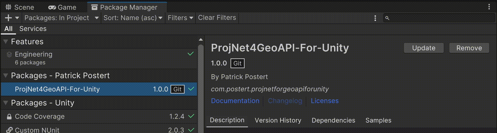
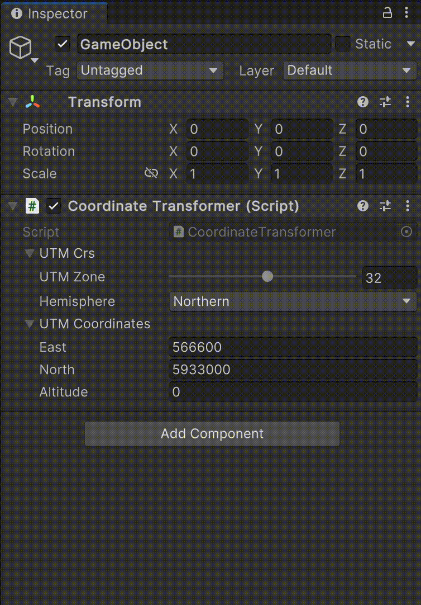
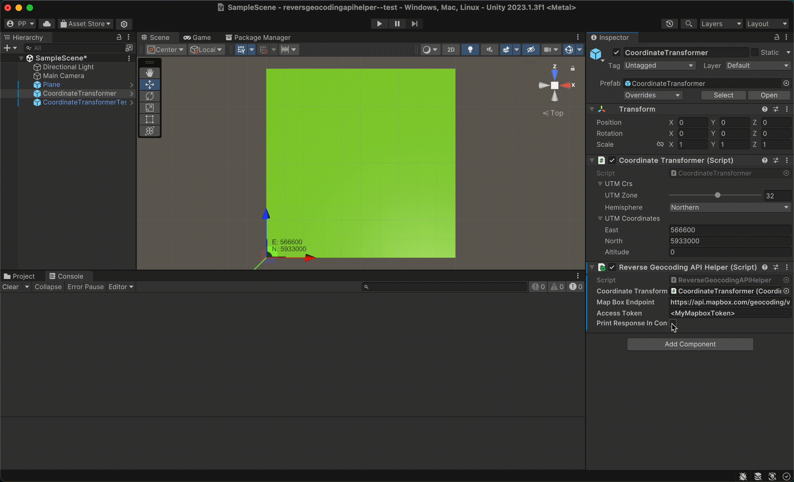

# ReverseGeocoding-For-Unity

## Synopsis

This library allows requesting address data from [Mapbox](mapbox.com)'s [Reverse Geocoding API](https://docs.mapbox.com/api/search/geocoding/#reverse-geocoding) in Unity. It supports Unity coordinates, WGS84/UTM coordinates and Geographic coordinates.

## Prerequisites
The library depends on the [ProjNet4GeoAPI-For-Unity](https://github.com/Postert/ProjNet4GeoAPI-For-Unity/) package, which provides coordinate transformation for processing geographic coordinates in Unity. As the Unity Package Manager (UPM) currently does not support custom git package dependencies, the package has to be installed manually. For the setup and configuration, follow the instructions in [ProjNet4GeoAPI-For-Unity](https://github.com/Postert/ProjNet4GeoAPI-For-Unity/)'s README file **before proceeding**.

## Installation

To add this library to your project, you can use the Package Manager:

Go to the package manager and click on “Install package from git URL” and add this URL:  

```
https://github.com/postert/ReverseGeocoding-For-Unity.git
```



## Configuration

#### Required Parameters

To request data from the Mapbox endpoint, an access token has to be created on the [Mapbox Account Page](https://account.mapbox.com/access-tokens/). At the time of this library's development, Mapbox offered a free quota of requests. However, charges may apply. Please check the current [Price Information from Mapbox](https://www.mapbox.com/pricing). Note that we do not assume any costs that may arise from the use of this library.

#### Configure ReverseGeocodingAPIHelper

To utilize Mapbox's reverse geocoding endpoint, add the `ReverseGeocodingAPIHelper` *MonoBehaviour* script to an arbitrary *GameObject* (preferably the one the `CoordinateTransformer` script of the ProjNet4GeoAPI-For-Unity library mentioned in the [Prerequisites](#prerequisites)) in the Unity scene and add the Mapbox access token.



## Reverse Geocoding Execution

This library offers three methods to request the address associated with (1) Geographic coordinates, (2) WGS84/UTM coordinates or (3) Unity coordinates:

```C#
// 1. Import the library's namespace
using GeocoordinateTransformer;
using ReverseGeocoding;

// ...

// 2. Define example coordinates to transform
private GeographicCoordinates geographicTestCoordinates = new(latitude: 53.5417104602435, longitude: 10.0051097859429, altitude: 4.25);
private UTMCoordinates utmTestCoordinates = new(east: 566605, north: 5933004, altitude: 3);
private Vector3 unityTestCoordinates = new(x: 1, y: 4, z: 5);

// ...

// 3. Find ReverseGeocodingAPIHelper with associated Mapbox access token in the Unity Scene
ReverseGeocodingAPIHelper reverseGeocoder = GameObject.FindAnyObjectByType<ReverseGeocodingAPIHelper>();

// 4. Execute Reverse Geocoding

// 4.1 GeographicCoordinates
ReverseGeocodedAddress address3 = await reverseGeocoder.GetAddressForGeographicCoordinatesAsync(geographicTestCoordinates)

// 4.2 UTMCoordinates
ReverseGeocodedAddress address2 = await reverseGeocoder.GetAddressForUTMCoordinatesAsync(UTMCoordinates utmTestCoordinates)

// 4.3 Vector3 (Unity)
ReverseGeocodedAddress address1 = await reverseGeocoder.GetAddressForUnityCoordinatesAsync(Vector3 unityTestCoordinates)
```

# Sample Scene (included in ProjNet4GeoAPI-For-Unity Library)

ProjNet4GeoAPI-For-Unity contains a sample scene, on which the sample for this library also relies. . Make sure that the *Sample Scene* is installed and loaded as described in the [Sample Scene section](https://github.com/Postert/ProjNet4GeoAPI-For-Unity#sample-scene-included-in-library), and add the `ReverseGeocodingAPIHelper` script as a *Component* as described above. A test can be executed via the component's context menu:



The square area of the *Sample Scene* corresponds to the spatial extent shown below:

```geojson
{
  "type": "FeatureCollection",
  "features": [
    {
      "type": "Feature",
      "id": 1,
      "properties": {
        "ID": 0
      },
      "geometry": {
        "type": "Polygon",
        "coordinates": [
          [
              [10.0050334941202,53.5416751454004],
              [10.0065422978258,53.541662455265],
              [10.0065636189796,53.5425611772512],
              [10.0050547833268,53.5425738678005],
              [10.0050334941202,53.5416751454004]
          ]
        ]
      }
    }
  ]
}
```
